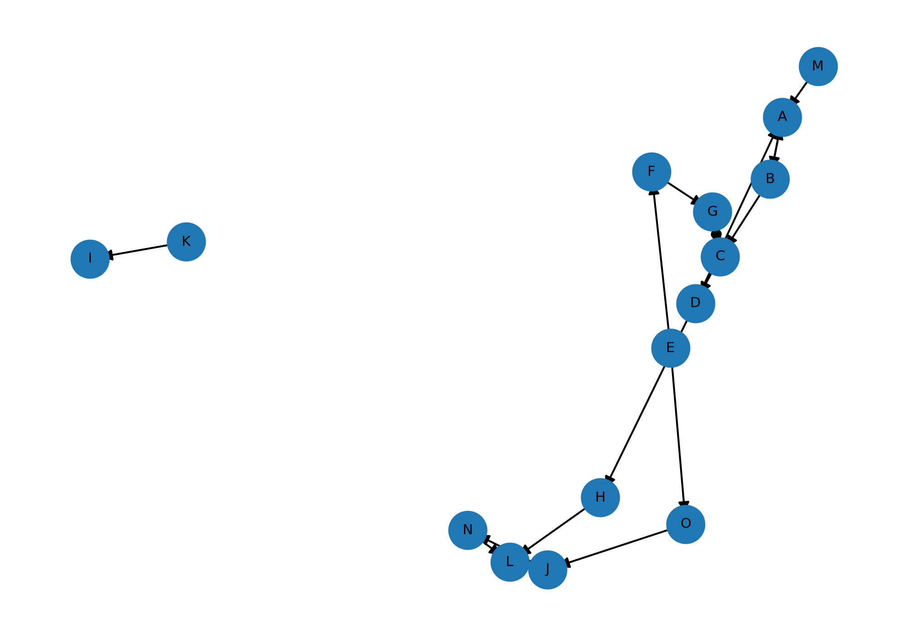

# HW1 Report
Name: Johnovon Richards  
Class: CS 432  
Assignment: HW1

---

## Q1: Bow-Tie Categories

### Graph
I created the directed graph from the given edge list and generated an image using NetworkX and Matplotlib.



### SCC
**A, B, C, D, G**

- These nodes form a strongly connected component. Each node is reachable from every other node through directed paths.  
- Example: A → B → C → D → A forms a cycle, and C ↔ G connects node G to the same mutually reachable group.

### IN
**E, F, M**

- These nodes can reach the SCC but are not reachable from it.  
- Example: M → A enters the SCC, E → F → G enters the SCC. No edges exist from the SCC back to these nodes.

### OUT
**H, L**

- These nodes are reachable from the SCC but cannot reach back into it.  
- Example: D → H → L places H and L downstream of the SCC.

### Tendrils
**None**

- There are zero nodes that are able to be reached from IN or that can reach OUT while staying disconnected from both the SCC and the tube structure.

### Tubes
**J, N, O**

- These nodes connect IN nodes to OUT nodes without passing through the SCC.  
- Specifically, E → O → J → N → L creates a path from the IN node E to the OUT node L.

### Disconnected
**I, K**

- Nodes K and I are disconnected from the main bow-tie structure.  
- Only the edge K → I exists, and neither node connects to the SCC, IN, or OUT areas.

### Method Used to Determine Categories
In order to classify the nodes, the first thing I did was identify the strongly connected component by finding the nodes that were reachable through directed cycles. I then traced the incoming and outgoing edges to identify IN nodes and determine OUT nodes. Finally, I analyzed the remaining nodes to determine whether they formed tube connections between IN and OUT, or if they were disconnected from the main structure.

---

## Q2: Using curl to Inspect HTTP Headers

### 1. Browser Request
I loaded the provided URI in my web browser. The webpage echoed the HTTP request headers sent by the browser, including the User-Agent header that identifies the browser and operating system.


---

### 2. curl Request with Custom User-Agent
I executed the curl command:

```bash
curl -i -L -A "CS432/532" https://www.cs.odu.edu/~mweigle/courses/cs532/ua_echo.php
```
The -i option displays HTTP response headers, the -L option follows redirects, and the -A option sets the User-Agent request header to CS432/532.


### 3. Saving HTML Output to a File
I executed the following command to save the HTML response to a file:

```bash
curl -L -A "CS432/532" -o ua_echo.html https://www.cs.odu.edu/~mweigle/courses/cs532/ua_echo.php
```


### 4. Viewing the Saved File
I opened the saved HTML file ua_echo.html in a web browser and verified that it displayed the echoed HTTP request headers, including the custom User-Agent value.


## Q3: Collecting 500 URIs of HTML Pages

### Program behavior

I wrote collect_webpages.py, and it takes a seed webpage URI as a command-line argument. The program downloads the seed page, extracts all hyperlinks from the HTML, and then requests each linked URI. It uses the Content-Type HTTP response header to determine whether or not the resource is an HTML page. If the resource is HTML, it then uses the Content-Length HTTP response header to check whether the page is larger than 1000 bytes. In the case that Content-Length is missing, the program falls back to checking the size of the downloaded response body. If requirements are met, the program prints the final URL after redirects and stores it in a set to ensure uniqueness. The crawler continues until it collects 500 unique qualifying URIs, then saves them to uris.txt.

### Timeout handling
To avoid hanging on slow or unresponsive servers, the program includes an HTTP timeout on requests.

### Command used
```bash
python collect_webpages.py https://weiglemc.github.io/ -n 500 -o uris.txt
```
### Seed webpages used
https://weiglemc.github.io/

### Output file
The list of 500 unique URIs was saved to uris.txt.

---

## References
- Broder et al., “Graph Structure in the Web”
- NetworkX documentation
- Python requests documentation
- BeautifulSoup documentation
- https://github.com/odu-cs432-websci/public-spr26/blob/main/HW1-intro.md