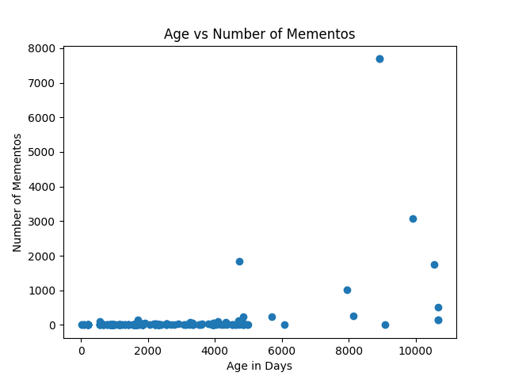
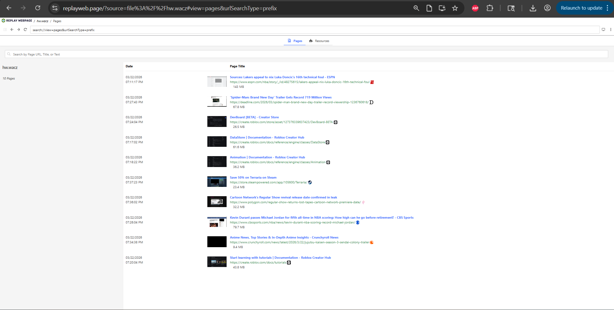
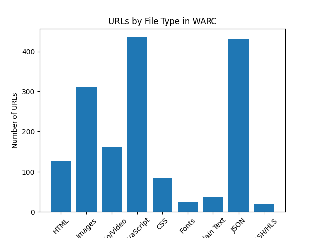

# HW4 Report

## Q1. Analyze Datetimes of Mementos

To complete this analysis, I used the TimeMaps collected in HW3. For each URI-R with at least one memento, I extracted the datetime of the earliest memento and calculated the age in days by subtracting it from the current date. I also recorded the total number of mementos for each URI-R.

I then created a scatterplot using Python with:
- x-axis: age of URI-R (in days)
- y-axis: number of mementos

### Relationship between age and number of mementos

There appears to be a **weak positive relationship** between the age of a URI-R and the number of its mementos. Older pages tend to have more mementos, but this is not consistent across all pages. Many older pages still have very few mementos, while a small number of pages have extremely large numbers of mementos.

### Oldest memento

The URI-Rs with the oldest mementos were associated with web archiving platforms such as:

- https://web.archive.org/
- http://web.archive.org/

This was not surprising because these are highly active and frequently archived websites that have existed for a long time.

### URI-Rs with age < 1 week

Very few URI-Rs had an age of less than one week, meaning only a small number of pages were first archived during the same week the dataset was collected. This shows that most archived pages have existed for much longer.

---

## Q2. Explore ArchiveWeb.page and ReplayWeb.page

### WARC File

Link to archive:
https://drive.google.com/file/d/1yBLtAeVNEH8Io9ranVfgpSDK5DHSNRAD/view?usp=sharing

### Topic Choice

I chose this topic because the webpages I archived are things that interest me, including gaming, sports, and anime content. This made it easier to explore and collect a variety of pages.

### Issues During Archiving

Yes, I encountered some issues during archiving. Some webpages took longer to archive than others, and some pages did not archive properly due to paywalls or requiring a login to access the content.

### Do Archived Pages Look Like Originals?

For the most part, the archived pages looked similar to the original webpages. However, some elements such as media, scripts, or interactive components did not load perfectly.

---

### URL vs Pages Comparison

- Total URLs archived: **3493**
- Total Pages archived: **10**

There are significantly more URLs than pages because each page includes many additional resources such as images, scripts, and stylesheets.

---

### URL Counts by File Type

| File Type | Count |
|----------|------:|
| HTML | 126 |
| Images | 312 |
| Audio/Video | 161 |
| JavaScript | 435 |
| CSS | 84 |
| Fonts | 25 |
| Plain Text | 37 |
| JSON | 431 |
| DASH/HLS | 20 |
| PDF | 0 |

---

### Which File Type Had the Most URLs?

JavaScript had the highest number of URLs (435), followed closely by JSON (431).

This was somewhat surprising, but it makes sense because modern websites rely heavily on JavaScript and API calls (JSON) to dynamically load content.

---

### Bar Chart

